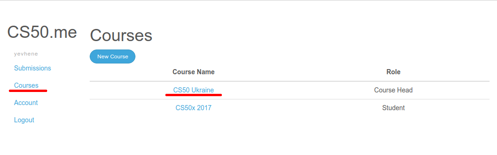
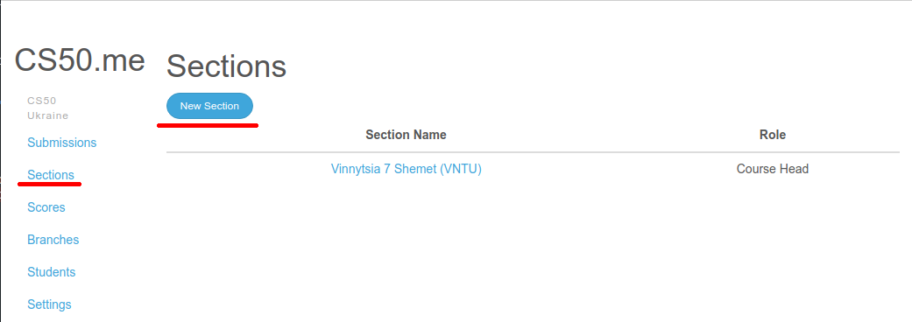
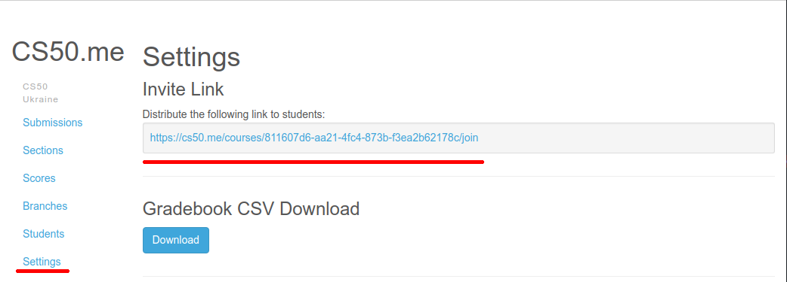
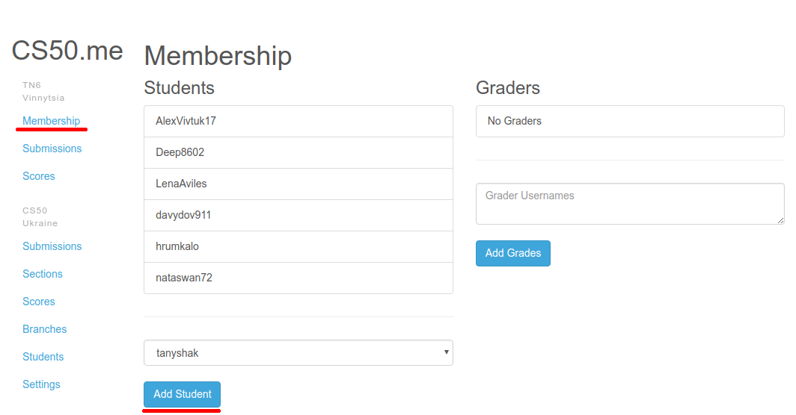
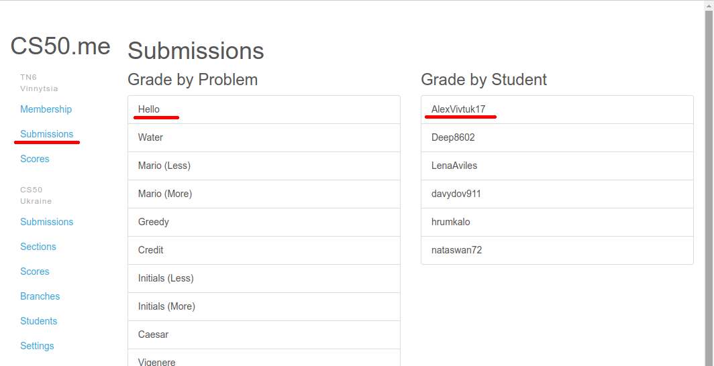
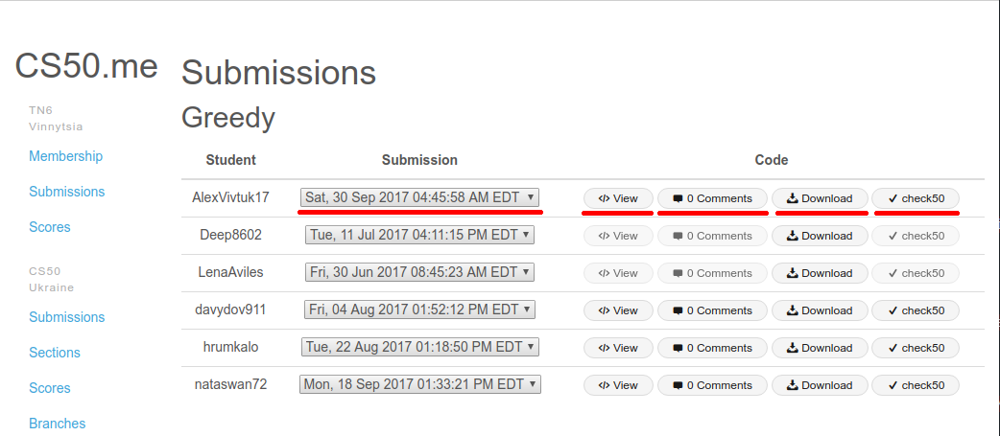
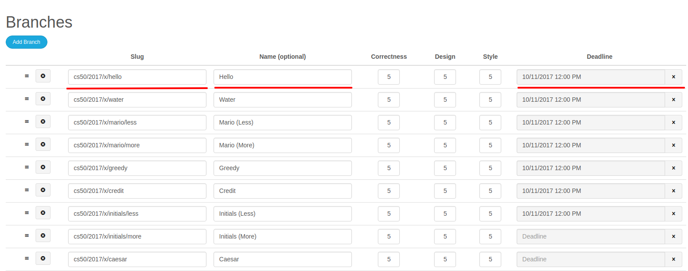
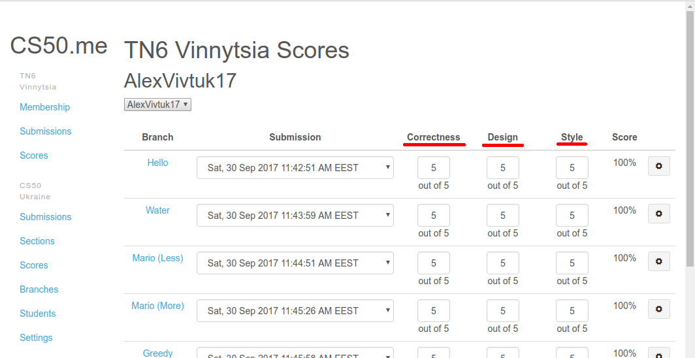

# cs50.me

Для перевірки та оцінювання студентських робіт використовується ресурс [cs50.me](http://cs50.me).

## Вхід та акредитація
Для входу використовується GitHub, попереньо зареєструтеся на ньому, якщо у вас ще немає облікового запису.

Для того щоб отримати доступ до інтерфейсу викладача, вам необхідно звернутися до когось хто має права надавати вам доступ. Наприклад до [Євгена Шемета](yevhene@gmail.com). В листі необхідно вказати ім'я користувача GitHub.

## Курс
Список курсів знаходиться в розділі "Courses" Всі ментори фонду BrainBasket використовують один курс "CS50 Ukraine".

## Секції
Список секцій знакозидться в розділі "Sections" у меню курсу зліва.

Для кожної групи створюється окрема секцію. Для того щоб створити нову секцію натисніть "New Section".
В назву секції рекомендовано включати назву міста, порядковий номер групи та ім'я ментора. В дужки можна включити додаткову інформацію, наприклад про місце проведенення. Приклад: "Vinnytsia 7 Shemet (VNTU)".

## Студенти
Спочатку студентів необхідно запросити до курсу. Для цього необхідно знайти посилання в розілі "Settings" курсу та передати його студентам. Воно однакове для всіх студентів.

Далі необхідно додати студента до своєї секції. для цього треба вибрати свою секцію зі списку, в розділі курсу "Sections". Далі в розділі меню секції "Membership" необхідно вибрати студента з випадаючого меню, та натиснути "Add Student". Нажаль наразі тут будуть всі студенти фонду.

## Подання
Коли студенти зареєструють свою роботу в системі за допомогою "check50", вона буде вам доступна через розділ секції "Submissions". Там ви можете вибрати всі подання студентів що стосуються однієї задачі або всі подання одного стундента.

В списку подань ви можете обрати конкретне подання студента, переглянути код на GitHub, перейти до коментування роботи, завантажити код або переглянути результати "check50".

## Редагування завдань
### Термін подання
При необхідності є можливість вказати дату, після якої роботі не будуть прийматись системою. Функція доступна в розділі "Branches".
### Максимальна кількість балів
В таблиці з описанням завдань, в розділі "Branches", ви можете обрати максимальну кількість балів для кожного критерію оцінювання.

## Оцінювання
В розділі секції "Scores" можна коректувати оцінки або виставляти оцінки.
Є три критерії оцінювання, в кожному студен може отримати від "0" до "5":
- "Correctness" - коректність. Наскільки програма коректно працює. Виставляється автоматично за допомогою "check50".
- "Design" - дизайн. Наскільки рішення елегантне та єфективне. Покладається на вас, за замовчуванням "5".
- "Style" - стиль. Чистота коду: форматування, пробіли, ітд. Виставляється автоматично за допомогою "style50".
Навіть, якщо оцінка виставлена автоматично, а ви з нею не згодні, ви можете корегувати її.

